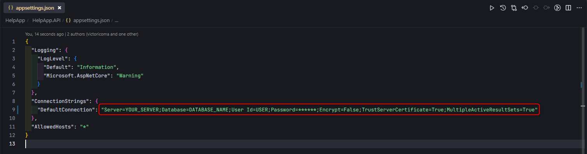
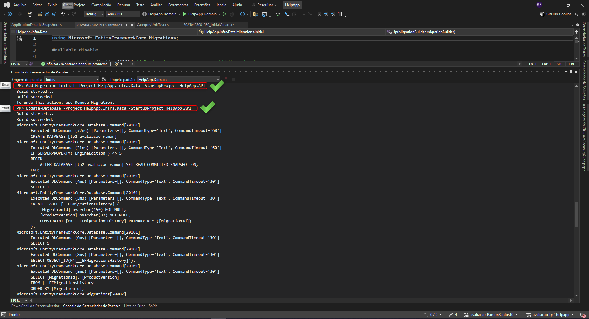
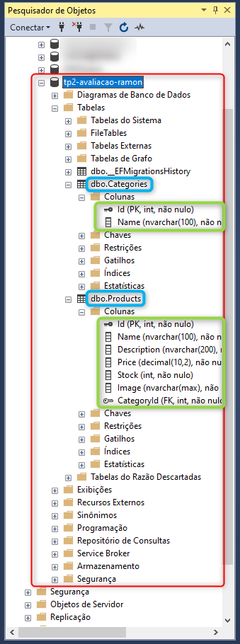
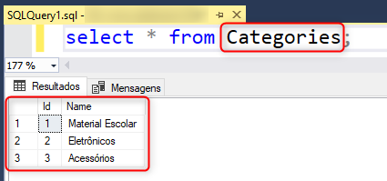

# 📘 Avaliação Técnica – Clean Architecture + Azure SQL

Este repositório contém minha entrega referente à avaliação técnica baseada no repositório original do professor:  
[https://github.com/victoricoma/avaliacao-tp2-helpapp](https://github.com/victoricoma/avaliacao-tp2-helpapp)

---

## ✅ Objetivo

Implementar os repositórios `Category` e `Product` seguindo os padrões da Clean Architecture, aplicar a migration `Initial` e conectar a aplicação com uma instância de SQL Server no Azure.

---

## 🚀 Funcionalidades implementadas

- [x] Repositórios `CategoryRepository` e `ProductRepository`
- [x] Configurações com `EntityTypeConfiguration` para `Category` e `Product`
- [x] Injeção de dependência configurada (`DependencyInjectionAPI`)
- [x] Migration `Initial` criada com `HasData()` para categorias
- [x] Banco de dados SQL Server criado no Azure
- [x] Migration aplicada com sucesso no Azure via `dotnet ef database update`

---
# 🔧 Comandos utilizados
## Criação da migration
dotnet ef migrations add Initial --project Infra.Data --startup-project WebAPI

## Aplicação no banco de dados (Azure)
dotnet ef database update --project Infra.Data --startup-project WebAPI


## Aplicação no banco de dados (Azure)
dotnet ef database update --project Infra.Data --startup-project WebAPI

# 🔗 String de conexão (SQL Server Local)

"ConnectionStrings": {
  "DefaultConnection": "Server=SEU_SERVIDOR;Database=NOME_DO_BANCO;User Id=USUARIO;Password=******;Encrypt=False;TrustServerCertificate=True;MultipleActiveResultSets=True;"
}

> **Observação:** Devido ao esgotamento dos créditos gratuitos na Azure, a aplicação foi migrada para utilizar SQL Server local. Esta alteração não afeta a funcionalidade do sistema, mantendo todas as características da implementação original.

# ☁️ Configuração no Azure
SQL Server criado no portal Azure

Banco de dados nomeado: avaliacao_tp2_aluno

IP local autorizado no firewall

Autenticação SQL ativada

Migration aplicada com sucesso diretamente do Visual Studio Terminal

## 🧱 Estrutura da aplicação

```bash
📦 src
 ┣ 📂 Domain
 ┣ 📂 Application
 ┣ 📂 Infra
 ┃ ┣ 📂 Data
 ┃ ┃ ┣ 📂 Migrations
 ┃ ┃ ┣ 📂 Repositories
 ┃ ┃ ┗ 📂 EntityConfiguration
 ┗ 📂 WebAPI
```

---

# 📝 Entrega do Aluno

## 👨‍💻 Dados do aluno
Nome: Ramon dos Santos
Curso: Desenvolvimento de Sistemas – 3º Semestre

Professor: Victor Icoma

Branch da entrega: avaliacao-RamonSantos10

## 🖼️ Prints de evidência

### 1. Configuração da Connection String do SQL Server Local

*Print da tela de configuração da Connection String do SQL Server Management Studio para a conexão local*

### 2. Aplicação das Migrations

*Print do terminal mostrando o comando de criação da migration e de atualização do banco sendo executados com sucesso*

### 3. Estrutura do Banco de Dados

*Print do SQL Server Management Studio mostrando as tabelas Category e Product criadas no banco local*

### 4. Dados na Tabela de Categorias

*Print mostrando os registros inseridos na tabela de "categories" através do HasData()*

### 5. Build para Entrega

*Print mostrando os registros inseridos na tabela de "categories" através do HasData()*


